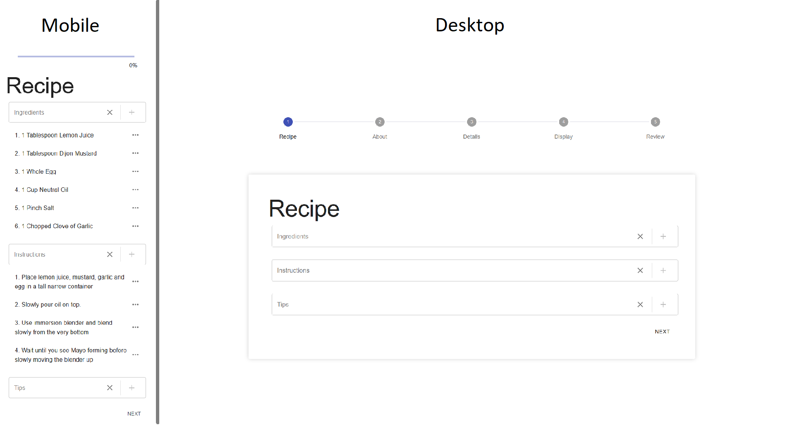

# react-material-formik-wizard

[](https://www.npmjs.com/package/react-material-formik-wizard) [](https://standardjs.com)

> Form Wizard using Material-ui, and Formik



## Install

```bash
npm install --save react-material-formik-wizard
```

## Usage

### FormItem

Input component wrapper.
Choose from the following options for the **_type_** property:
"checkbox", "select", "dynamictext", "textarea", "text" **_default is text_**

**Props**

```
type: PropTypes.string.isRequired,
label: PropTypes.string.isRequired,
name: PropTypes.string.isRequired,
error: PropTypes.object.isRequired,
touched: PropTypes.object.isRequired,
variant: PropTypes.string.isRequired,
onChange: PropTypes.func.isRequired,
onBlur: PropTypes.func.isRequired,
placeHolder: PropTypes.string,
options: PropTypes.array // for select and checkbox only
value: // PropType is string or array of objects
```

material-ui variant is optional, default is set to "outlined"

_Select_
Options properties example:

```
options={[
{ label: "Condiment", value: "Condiment" },
{ label: "Dip", value: "Dip" },
{ label: "Sauce", value: "Sauce" },
{ label: "Marinade", value: "Marinade" },
{ label: "Other", value: "Other" }
]}
```

_CheckBox_
Options properties example:

```
 options={[
  { id: "bitter", label: "Bitter" },
  { id: "numbing", label: "Numbing" },
  { id: "salty", label: "Salty" },
  { id: "sour", label: "Sour" },
  { id: "spicy", label: "Spicy" },
  { id: "sweet", label: "Sweet" },
  { id: "umami", label: "Umami" }
]}
```

### FormWizard

Properties:

```
formComponents: PropTypes.object.isRequired,
doSubmit: PropTypes.func.isRequired,
displayProgress: PropTypes.bool.isRequired,
successTitle: PropTypes.string.isRequired,
successTitleComponent: PropTypes.string.isRequired,
successMessage: PropTypes.string.isRequired,
successMessageComponent: PropTypes.string.isRequired
```

Create individual forms using formik, import each form into desired page, then set up an array of form objects shown below.
Usage example:

```
import React from "react";
import { FormWizard } from "react-material-formik-wizard";

import RecipeStep from "./steps/RecipeStep";
import AboutStep from "./steps/AboutStep";
import DetailStep from "./steps/DetailStep";
import DisplayStep from "./steps/DisplayStep";
import Review from "./steps/Review";

function App() {
  const steps = [
    {
      component: RecipeStep,
      title: "Recipe"
    },
    {
      component: AboutStep,
      title: "About"
    },
    {
      component: DetailStep,
      title: "Details"
    },
    {
      component: DisplayStep,
      title: "Display"
    },
    {
      component: Review,
      title: "Review"
    }
  ];

  const doSubmit = values => {
    alert("submitting: " + JSON.stringify(values));
    console.log("submitting valuess", values);
  };

  return (
    <React.Fragment>
      <FormWizard
        displayProgress={true}
        formComponents={steps}
        doSubmit={doSubmit}
        successTitle={"Success"}
        successTitleComponent={"h1"}
        successMessage={"Your recipe has been submitted"}
        successMessageComponent={"h5"}
      />
    </React.Fragment>
  );
}

export default App;

```

## Example Project

To run the example project to see how it is used.

```bash
git clone https://github.com/GlennChon/react-material-formik-wizard.git
```

Move into the cloned directory's example folder and install the dependencies and run to package

```bash
cd react-material-formik-wizard
npm install
npm start
```

In a new terminal, install example dependencies and start the project.

```bash
cd ./example
npm install
npm start
```

Navigate into React

## License

MIT © [GlennChon](https://github.com/GlennChon)
